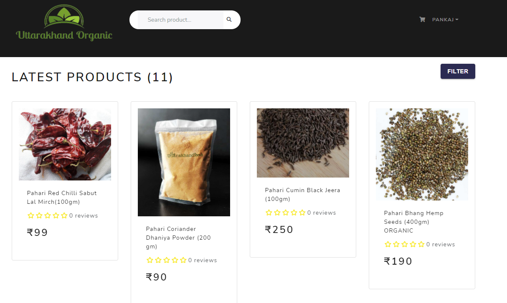

# Welcome to Uttarakhand Organic - An ecommerce Portal! ✨

**Project Link** - ***https://uttarakhand_organic.herokuapp.com/***



## Features and Functionalities 😃

**User features**

- Full featured shopping cart
- Product reviews and ratings
- Filtering (short by, category, & price range)
- Account Verification (2 factor authentication using email)
- Password Reset (Forget Password)
- Token based authentication
- Product search feature
- User profile with orders
- Save Cart
- Delete Cart
- Choose quantity (No of items to be order)
- Checkout process (shipping, payment method, etc)
- Order summary
- PayPal / credit card integration
- Database seeder (products, users, reviews, & orders)
- Print User orders as pdf
- Print UserList as pdf
- Print OrderList as pdf

**Admin features**

- Product management
- User management
- Order management
- Order details page
- Mark orders as delivered option

## Tech Stack 💻

- [React.js](https://reactjs.org/)
- [Node.js](https://nodejs.org/en/)
- [Express.js](https://expressjs.com/)
- [MongoDB Atlas](https://www.mongodb.com/cloud/atlas)
- [Material UI](https://material-ui.com/)
- [React Bootstrap](https://react-bootstrap.github.io/)
- [Redux](https://redux.js.org/)

## API :man_technologist:

- [PayPal API](https://developer.paypal.com/)
- [Cloudinary API](https://cloudinary.com/)

## Installation :zap:

**1. Clone this repo by running the following command :-**

```bash
 git https://github.com/GauravNegi000/uttarakhand_organic.git
 cd uttarakhand_organic
```

**2. Now install all the required packages(frontend & backend) by running the following commands :-**

```
yarn install
cd client
yarn install
```

**2. Create a config.env file in config folder and add the following**

```
PORT=5000
NODE_ENV=development

MONGO_URI =your mongodb uri

PAYPAL_CLIENT_ID=your paypal client id

FILE_UPLOAD_PATH=./public/uploads/product
FILE_UPLOAD_SIZE=1000000

JWT_SECRET=your key
JWT_EXPIREIN=30d

CLOUD_NAME=your cloudinary name
API_KEY=your cloudinary api key
API_SECRET=your cloudinary api secret key

FROM_EMAIL=your sender email
FROM_NAME=Uttarakhand Organic

```

**3. Seed Database**

```
# Import data
node seeder -i

# Destroy data
node seeder -d
```

**4. Now start the react and node server by running the following command :-**

```
#Start the server
yarn run dev

#Start the client side app
cd client

yarn start
```

**5.** **🎉 Open your browser and go to `https://localhost:3000`**
